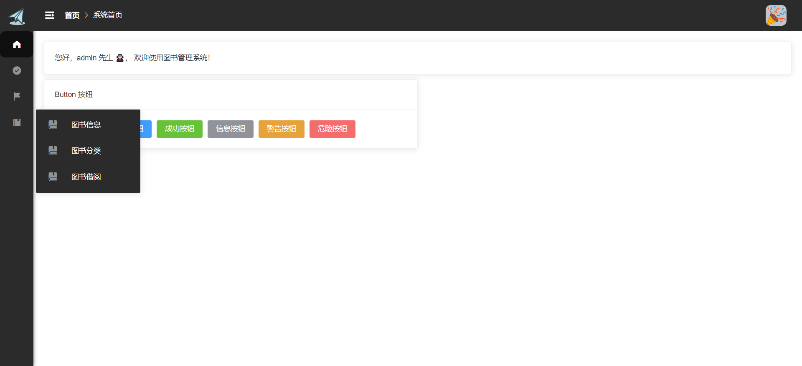

# 项目介绍

基于 SpringBoot + Vue 的用户管理项目模板

# 项目技术栈

- 后端：SpringBoot

- 前端：Vue
- 数据库：MySQL

# 实现功能

- 登录/注销
- 多角色登录
- 系统首页
- 用户中心
- 修改密码
- 用户管理
- 图书管理
- 图书分类
- 图书借阅

# 项目运行

> 登录界面

> 注册界面

> 系统首页

> 用户管理

> 图书管理

> 图书分类

> 图书借阅

> 个人中心

> 修改密码

> 菜单折叠功能